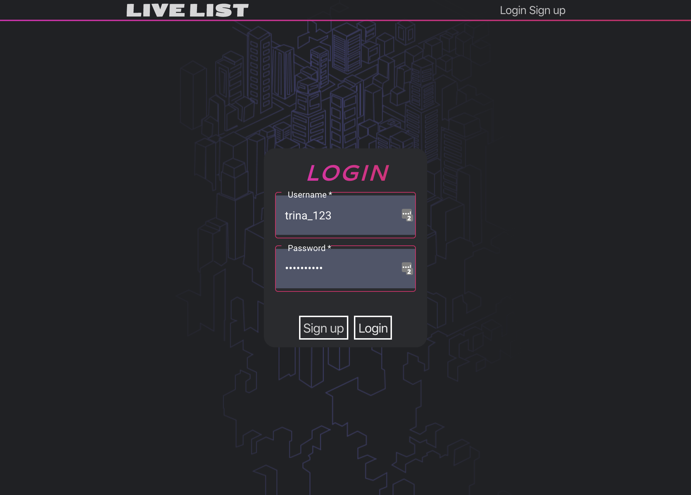
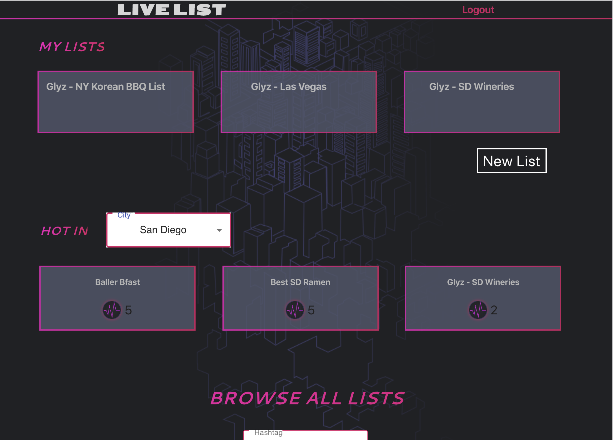
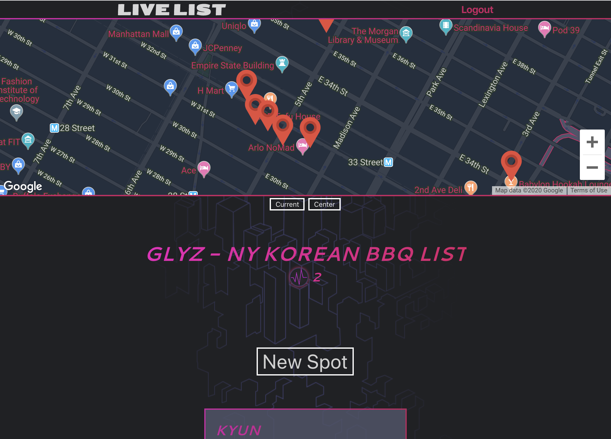
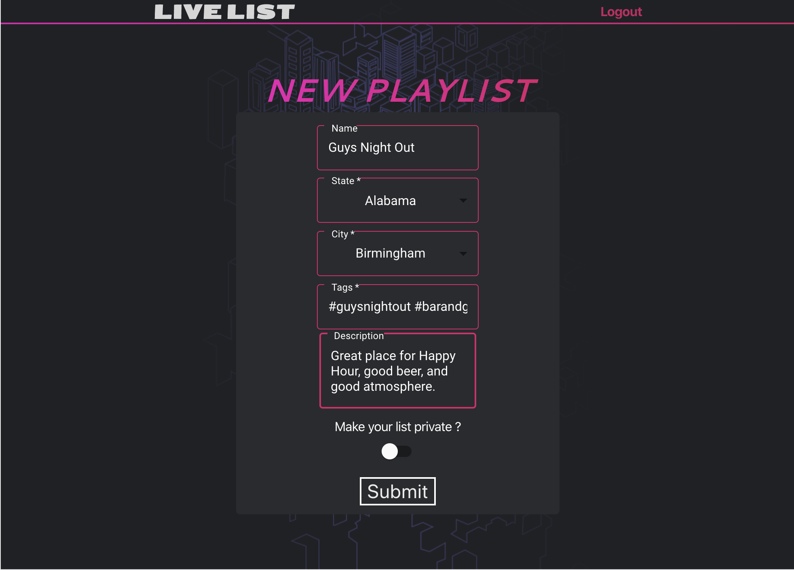
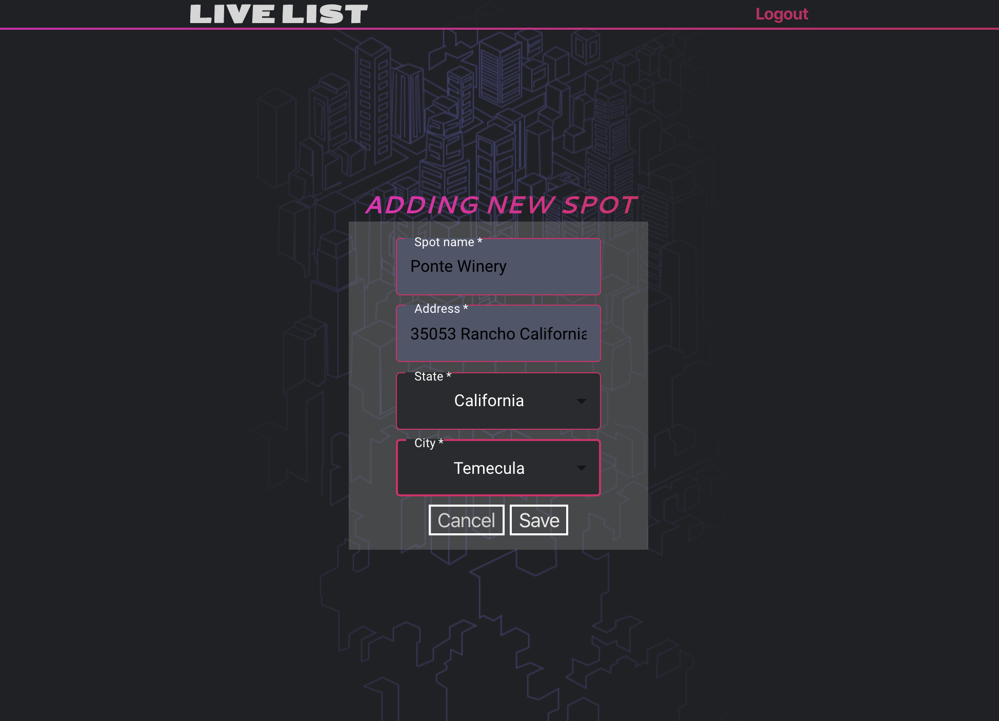
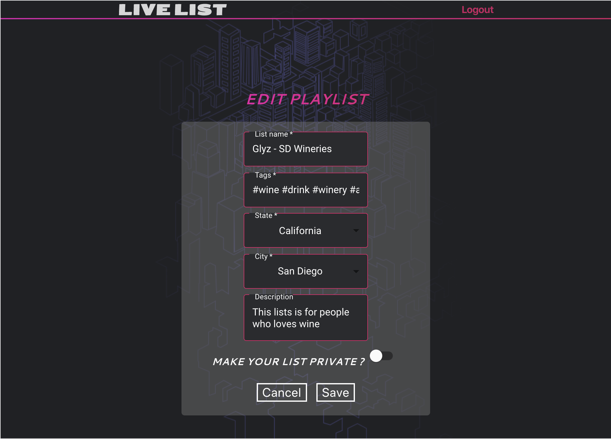
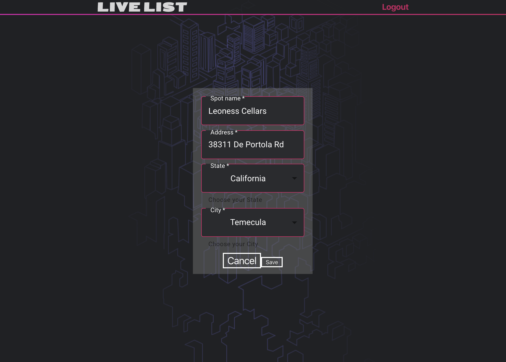

## Live List Client

It is a collaboration between [Daniel Lee Bright](https://github.com/Brahyt), [Glaiza Wagner](https://github.com/glaizawagner), [Wesley Jacobs](https://github.com/wjacobs71086), [Julio Hernandez](https://github.com/hernandez-crypto), and [Lazandrea Celestine](https://github.com/zeecelest)

- [Live app](https://social-playlist.netlify.com)
- [Client-repo](https://github.com/thinkful-ei-heron/SocialPlaylist-Client)
- [Server-repo](https://github.com/thinkful-ei-heron/SocialPlaylist-server)
- [Heroku-endpoint](https://still-fortress-90057.herokuapp.com)
- [Heroku-git](https://git.heroku.com/still-fortress-90057.git)

## Account login for demo

&ensp;username: trina_123  
&ensp;password: TR789Lk09!

## Technologies

&ensp;<strong>Client Side:</strong> 
- HTML5 | CSS3 | React  |  Javascript  |  Cypress   |  JWT-Decode  |  Material-UI | APIs (GoogleMap and Restaurants) 
- Deployed in Netlify

&ensp;<strong>Server Side:</strong> 
- Node | Express | PostgreSQL | GeoCode | Bcryptjs | JWT | Morgan | Chai | Supertest 
- Deployed in Heroku 

## Summary
Live List helps users find new places that other users visited and liked. It provides a customizable list from users who have the inside track on what is going on. The user dashboard has the `Hot Lists`, where user can filter it by city. User can also use hashtags of what playlist they are interested in. Using Live List is putting your entertainment experience in the hands of the people who tried it. This application focuses on the enjoyment of being introduced to something new. Using Live List will allow users to feel at home wherever they go. Live like the Locals with LIVE LIST!

## Screenshots
<strong>Landing Page</strong> 

<strong>Sign up Page</strong>

<strong>Log in Page</strong>

<strong>Dashboard Page</strong>

The user's dashboard shows all playlists created by the user. It also shows all the `Hot lists` where user can filter by the city. Hot lists is based on the top 1% of all the likes of all the users. 

This page also shows combined users playlists. The user can browse the list or use a hashtag `i.e. #fun` to display the playlists they are interested in. When user clicks other users' playlists, they will be redirected to the List Page route `list/:id`. It will show all the spots created by that user in their playlist. 

<strong>List Page</strong>

This page is in route `list/:id`. It has a map that marks all the spots that the user added to their list. When the user hovers over one of the spot markers and clicks the spot name, it will display the details of that spot. 

Below the map there is `current` and `center` buttons. When user clicks the `current` button, it will bring you to user's current location. When you click the `center` button,it will bring you to the center location of the spot lists.

The page also displays the name of the playlist and the lists of spots created by the user or what playlist was clicked by that user. 
The `delete` and `edit` button will only appear to the user. 

<strong>Add Playlist Form</strong>

When user clicks the `New Playlist` button in the user's dashboard, it will bring user to the `/newList` route where user needs to provide the required information such as playlist name, city, state, tags, description, and an option if they want their list private. 

<strong>Add Spot Form</strong>

When user clicks one of their playlists in their dashbard or under `Browse all lists`, user will be linked to route `list/:id`. The `New Spot` button will only appear to that user. When this button is clicked, it will bring user to route `/newSpot`. In the form for adding a spot, user is required to fill in information such as Spot name, address, city, and state. 

<strong>Update Playlist Form</strong>

The page route is `updateSpot/:id`. In this form the user can update their playlist. 

<strong>Update Spot Form</strong>

The page route is `updateList/:id`. In this form the user can update their spots. 

Copyright © 2020